<div align="center">

# Voice Commander

**Offline voice control for Windows**

Say a phrase, run a command: open apps, change the volume, take screenshots, or chain your own workflows.
English and Arabic, recognized on your machine.


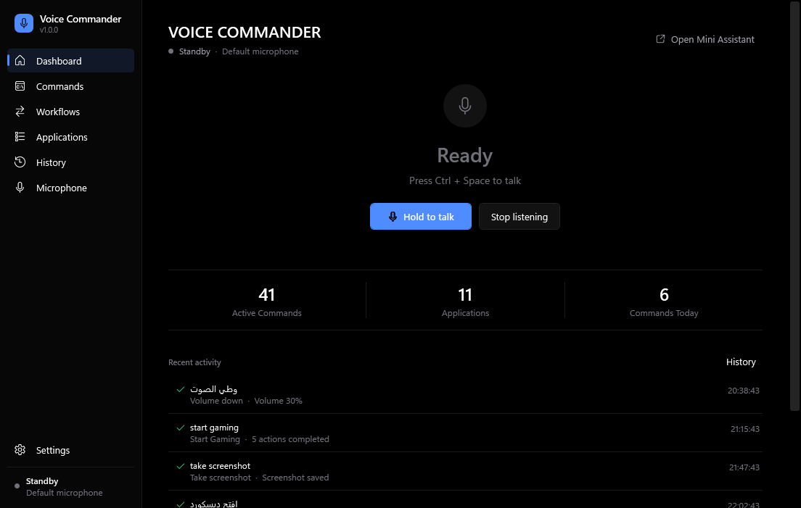

</div>

## ✨ Features

- **Offline speech recognition**: English with [Vosk](https://alphacephei.com/vosk/), Arabic with a local [Whisper](https://github.com/ggerganov/whisper.cpp) model. No audio leaves your PC.
- **Exact command matching**: recognized text only *selects* a command you already defined. It is never run as a shell command.
- **Custom commands and workflows**: a visual editor chains actions (open/close/focus apps, folders, URLs, volume, screenshots, waits, keyboard shortcuts, notifications, lock).
- **Application registry**: add, auto-detect, locate and test-launch the apps your commands refer to.
- **Floating assistant**: a small always-on-top overlay that shows listening, processing, the recognized phrase and the result. It can be collapsed.
- **Push-to-talk or always listening**: `Ctrl+Space` by default, optional wake phrase, microphone picker with a live level meter.
- **Global hotkeys** with conflict detection, system tray, notifications, local history.
- **English and Arabic UI** with real right-to-left layout and live language switching. True-black theme.
- **Safe by default**: power commands (shutdown, restart, sign out, sleep) are off until you enable them, and need confirmation. A 1.5 s cooldown stops one utterance from firing twice.
- **Import / export** of commands and applications as `.voicecommander` JSON.

## How it works

```
Microphone → Speech Engine → Command Matcher → Action Executor → Result
              │                │                  │
              │                │                  └─ runs the actions of the matched command
              │                └─ normalizes text (case, punctuation, Arabic letters, spoken numbers)
              └─ English → Vosk · Arabic → local Whisper
```

The matcher supports templates such as `volume {number}`, `{app} volume {number}`, `mute {app}` and `open {app}`.

## Screenshots

### Dashboard

<table>
  <tr>
    <td width="50%"><br><sub>Dashboard</sub></td>
    <td width="50%">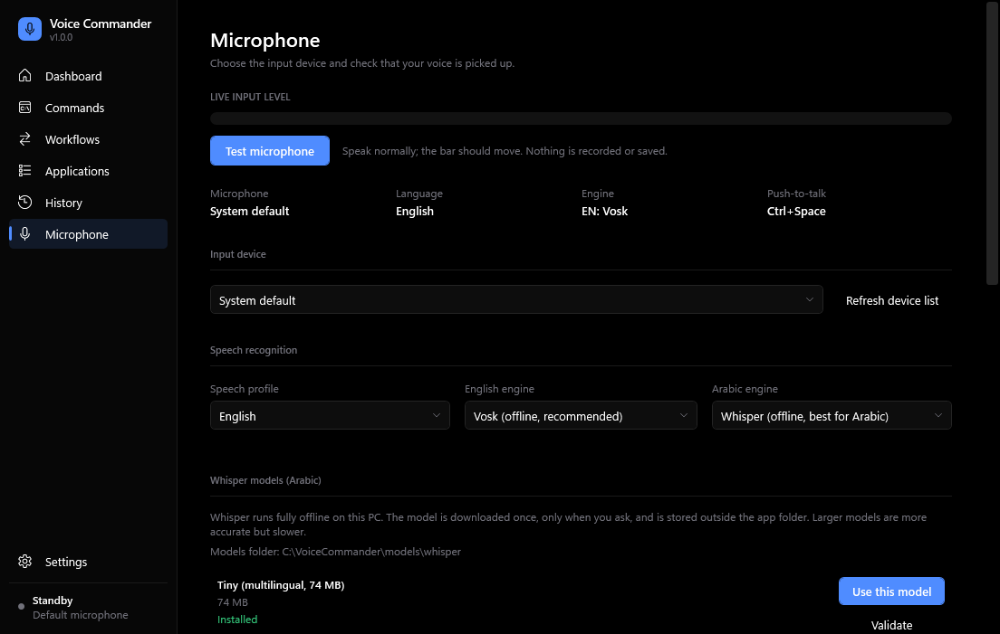<br><sub>Microphone &amp; speech engines</sub></td>
  </tr>
</table>

### Commands & Applications

<table>
  <tr>
    <td width="50%">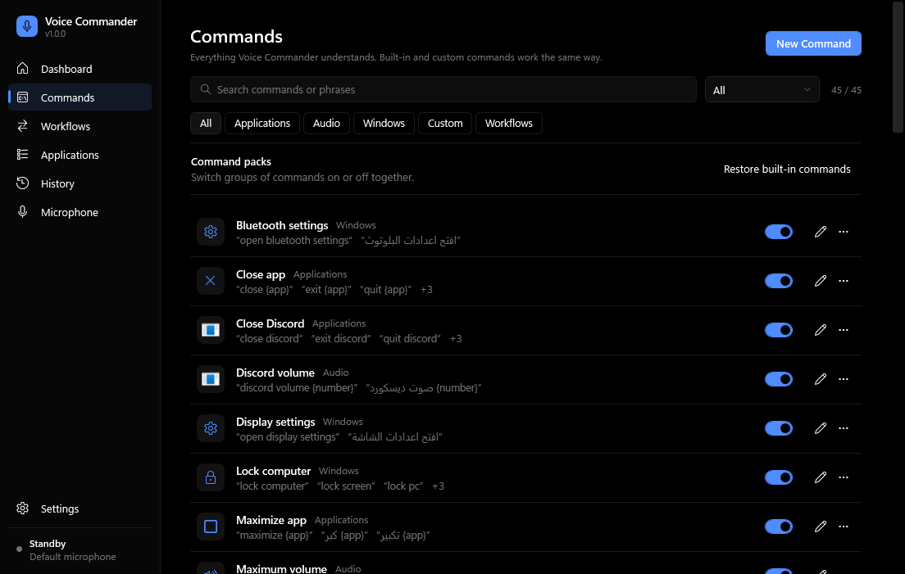<br><sub>Commands</sub></td>
    <td width="50%">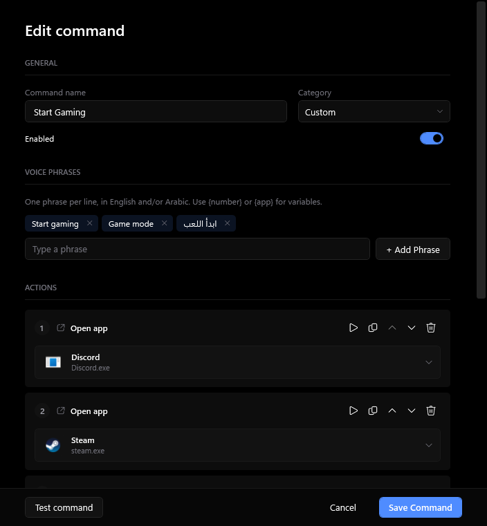<br><sub>Command editor</sub></td>
  </tr>
  <tr>
    <td width="50%">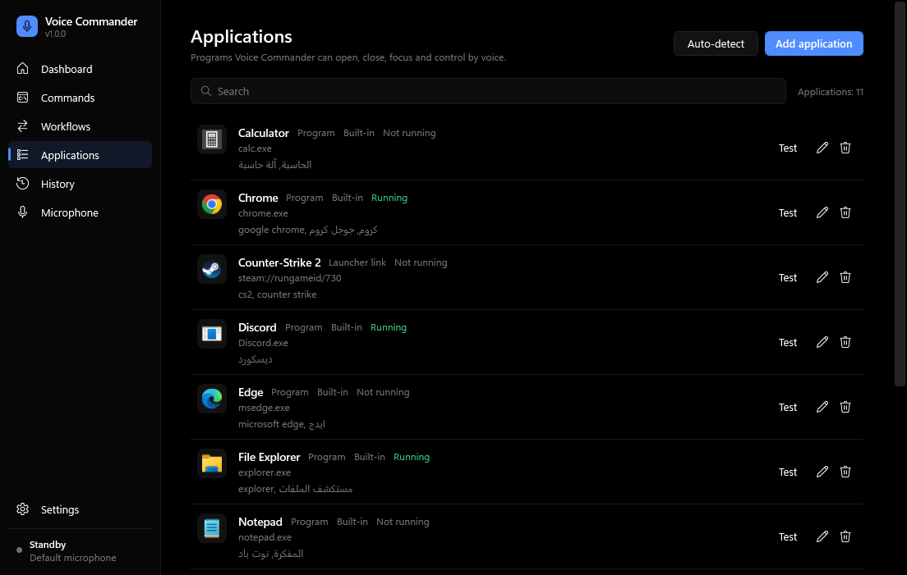<br><sub>Applications</sub></td>
    <td width="50%">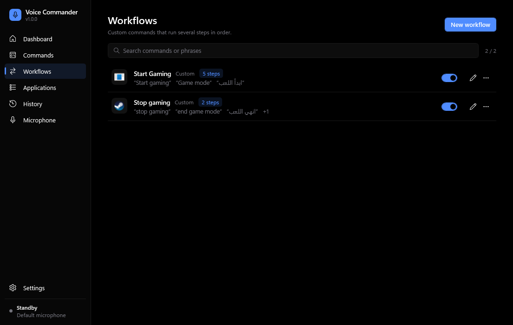<br><sub>Workflows</sub></td>
  </tr>
  <tr>
    <td width="50%">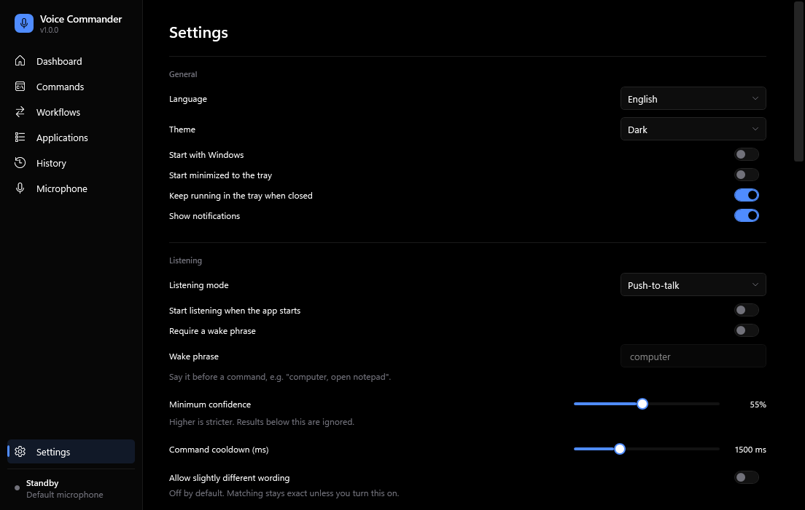<br><sub>Settings</sub></td>
    <td width="50%"></td>
  </tr>
</table>

### Voice Assistant

<table>
  <tr>
    <td width="33%">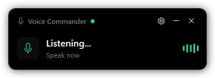<br><sub>Listening</sub></td>
    <td width="33%">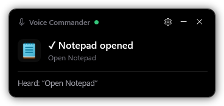<br><sub>Command recognized and run</sub></td>
    <td width="33%">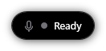<br><sub>Collapsed</sub></td>
  </tr>
</table>

### Arabic Interface

<table>
  <tr>
    <td width="50%">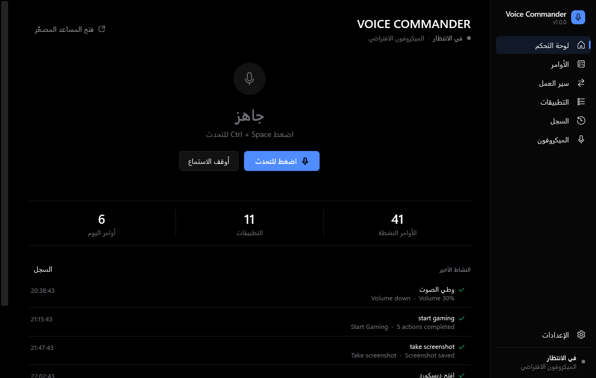<br><sub>Dashboard</sub></td>
    <td width="50%">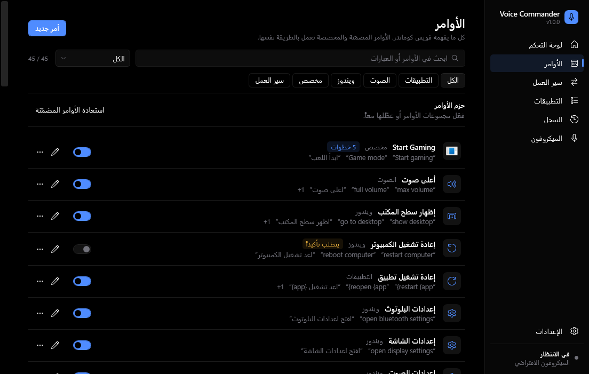<br><sub>Commands</sub></td>
  </tr>
  <tr>
    <td width="50%">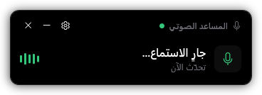<br><sub>Assistant, listening</sub></td>
    <td width="50%">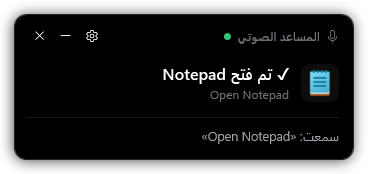<br><sub>Assistant, success</sub></td>
  </tr>
</table>

## Getting started

Download `VoiceCommander-1.0.0-Setup.exe` from the [Releases](../../releases) page (or build it yourself, see [Build a release](#build-a-release)) and run it. It installs per user into `%LOCALAPPDATA%\Programs\Voice Commander\`, needs no administrator rights, and offers an optional desktop shortcut and launch after install.

It is self-contained: you do not need to install .NET.
The installer is not code-signed, so Windows SmartScreen may warn on first run.

### First run

1. **Pick a language** (English or Arabic) and your **microphone**.
2. **Install a speech model.** Models are large and are *not* part of the repository or the installer. Download them from the Microphone page (or the setup wizard); the app only goes online when you press Download.
3. **Choose how to talk**: push-to-talk (default `Ctrl+Space`: hold it, speak, release) or always listening.
4. Say **"open notepad"**.

| Language | Engine | Model download |
| --- | --- | --- |
| English | Vosk | `vosk-model-small-en-us-0.15` (~40 MB) |
| Arabic | Whisper (local) | `ggml-small` (~465 MB, default) or tiny / base / medium; checked against a published size and SHA-256 |
| Arabic (alternative) | Vosk | `vosk-model-ar-mgb2-0.4` or `vosk-model-small-ar-tn-0.1-linto`, if you prefer it |

## Example commands

| Say (English) | Say (Arabic) | Does |
| --- | --- | --- |
| Open Discord | افتح ديسكورد | Launches Discord |
| Open Notepad | افتح المفكرة | Launches Notepad |
| Volume down | وطي الصوت | Lowers the master volume |
| Take screenshot | صور الشاشة | Saves a screenshot |

All phrases are editable, and you can add your own in either language.

### Custom commands

Commands page → **New command**: give it a name, one or more phrases and an ordered list of actions. **Test** runs it through the same pipeline as a spoken command.

**Start Gaming**: *Open Discord → Open Steam → Wait 2 s → Launch CS2 → Set volume 40*

## Floating assistant

An always-on-top overlay that follows the pipeline: **listening**, **processing**, the **recognized phrase**, then the **result** (success, no match, or error). Collapse it to a small indicator when you want it out of the way.

## Privacy

- Speech is recognized **locally**. Audio is not uploaded and not recorded to disk.
- No account, no API key, no telemetry.
- Settings, commands and history stay on your machine in `%APPDATA%\VoiceCommander\`.
- The only network access is the model download you start yourself.

| Path (under `%APPDATA%\VoiceCommander\`) | Purpose |
| --- | --- |
| `settings.json` | preferences |
| `applications.json` | application registry |
| `commands.json` | commands (built-in and custom) |
| `history.jsonl` | local history (last 500 entries) |
| `models\` | downloaded speech models (`models\whisper` for Whisper) |
| `logs\` | rotating logs |

Uninstalling keeps this folder. Delete it yourself for a full removal.

## System requirements

- Windows 10 or 11, x64
- A microphone
- Disk space for the models you choose (from about 40 MB for English; Whisper models range from 74 MB to 1.4 GB)
- Whisper runs on the CPU; larger models need more RAM and are slower per phrase

## Build from source

Requires the [.NET 8 SDK](https://dotnet.microsoft.com/download/dotnet/8.0) on Windows.

```powershell
dotnet build VoiceCommander.sln
dotnet test tests\VoiceCommander.Tests\VoiceCommander.Tests.csproj
dotnet run --project src\VoiceCommander.App
```

The test suite has 318 tests. The Vosk integration tests recognize real speech and are skipped unless `VC_MODEL_EN` points at an unpacked `vosk-model-small-en-us-0.15` folder.

### Build a release

```powershell
powershell -ExecutionPolicy Bypass -File scripts\publish.ps1
```

This cleans the old output, builds, runs the tests, publishes a self-contained win-x64 build and compiles the installer (needs [Inno Setup 6](https://jrsoftware.org/isinfo.php)). The result:

```
target/release/
├── publish/    intermediate self-contained publish the installer is built from
└── bundle/
    └── VoiceCommander-1.0.0-Setup.exe     <- the final installer
```

The installer is `target/release/bundle/VoiceCommander-<version>-Setup.exe`; the version comes from `Directory.Build.props`, so a bump there renames the file on the next build. `bundle/` holds only final distributables.
Add `-Portable` to also put the portable ZIP and `SHA256SUMS.txt` into `bundle/`.

## Project structure

```
src/VoiceCommander.Core        models, matching, pipeline, action handlers, speech engines, services
src/VoiceCommander.App         WPF app (MVVM): views, view models, tray, assistant overlay, localization
tests/VoiceCommander.Tests     xUnit tests
installer/VoiceCommander.iss   Inno Setup script
scripts/publish.ps1            release build and packaging
docs/screenshots/              screenshots used in this README
```

Extension points: `ISpeechRecognitionEngine` (another recognizer), `ICommandActionHandler` (another action type), `IConfirmationService` (confirmation for dangerous actions).

## Known limitations

- Accuracy depends on the model. The small English Vosk model is fast but not perfect; short, distinctive phrases work best.
- Arabic with Whisper transcribes after you finish speaking, so there is a short delay, longer with bigger models or slower CPUs.
- Per-app volume works only for apps that currently have an audio session.
- Windows only (x64). The installer is unsigned.
- Matching is exact (with normalization) by design; free-form natural language is not understood.

## Roadmap

- Code-signed installer and a winget manifest
- More command packs
- Better per-command feedback and history filtering

## License

No license file has been added yet; until one is, all rights are reserved by the author.

## Contributing

Issues and pull requests are welcome. Please keep changes focused, run `dotnet test` before opening a PR, and do not commit settings, logs or speech models (`.gitignore` already excludes them).
